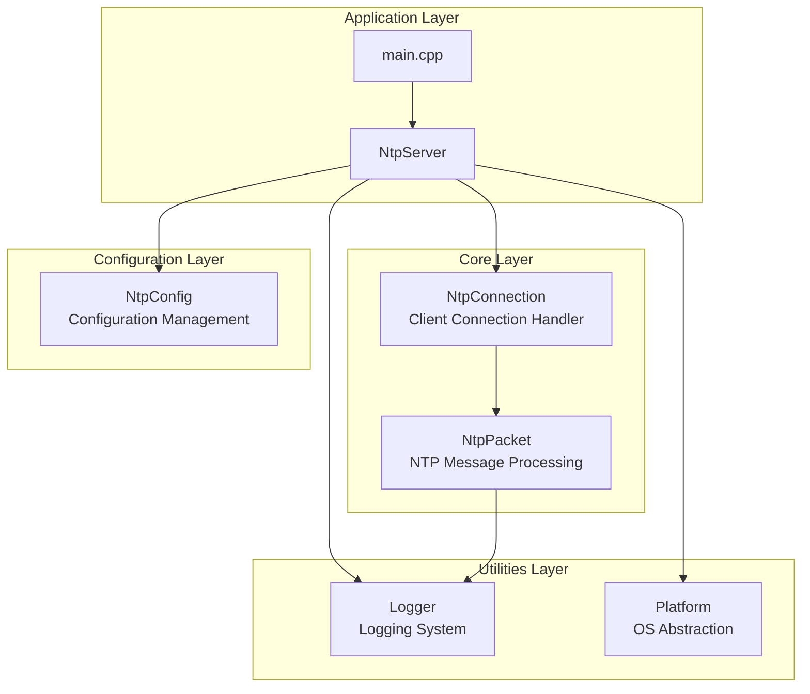
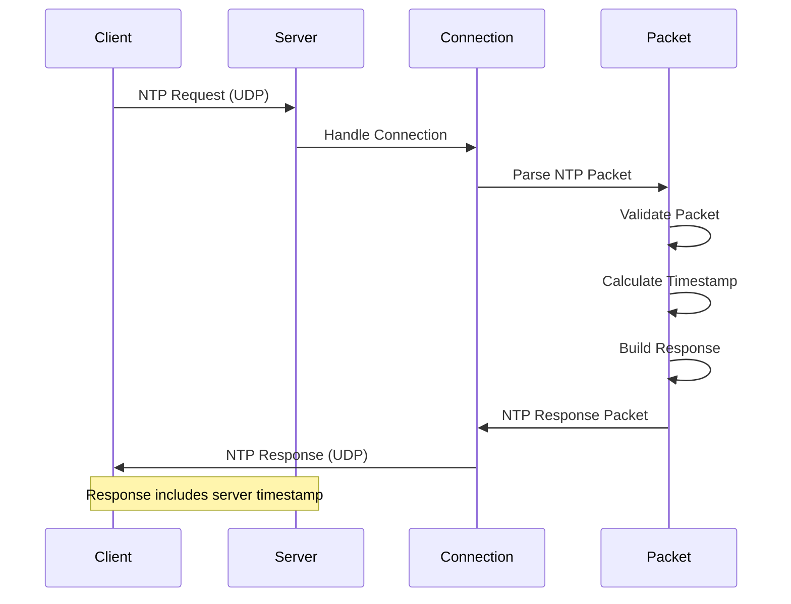
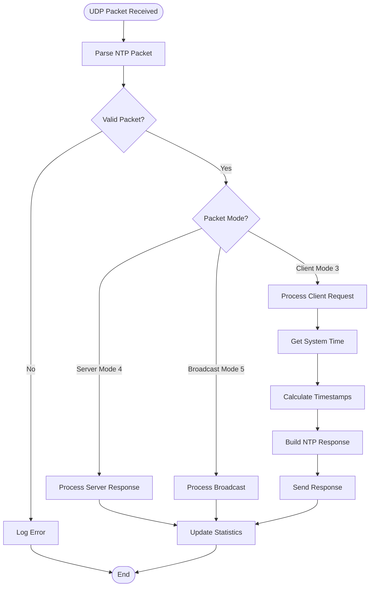

# Simple NTP Daemon - Architecture Diagrams

## System Architecture

```mermaid
graph TB
    subgraph "Application Layer"
        Main[main.cpp]
        Server[NtpServer]
    end
    
    subgraph "Core Layer"
        Connection[NtpConnection<br/>Client Connection Handler]
        Packet[NtpPacket<br/>NTP Message Processing]
    end
    
    subgraph "Configuration Layer"
        Config[NtpConfig<br/>Configuration Management]
    end
    
    subgraph "Utilities Layer"
        Logger[Logger<br/>Logging System]
        Platform[Platform<br/>OS Abstraction]
    end
    
    Main --> Server
    Server --> Connection
    Server --> Config
    Server --> Logger
    Server --> Platform
    
    Connection --> Packet
    Packet --> Logger
```

## NTP Packet Exchange Flow

```mermaid
sequenceDiagram
    participant Client
    participant Server
    participant Connection
    participant Packet
    
    Client->>Server: NTP Request (UDP)
    Server->>Connection: Handle Connection
    Connection->>Packet: Parse NTP Packet
    Packet->>Packet: Validate Packet
    Packet->>Packet: Calculate Timestamp
    Packet->>Packet: Build Response
    Packet->>Connection: NTP Response Packet
    Connection->>Client: NTP Response (UDP)
    
    Note over Client,Server: Response includes server timestamp
```

## NTP Server Processing Flow

```mermaid
flowchart TD
    Start([UDP Packet Received]) --> Parse[Parse NTP Packet]
    Parse --> Validate{Valid Packet?}
    Validate -->|No| LogError[Log Error]
    Validate -->|Yes| CheckMode{Packet Mode?}
    
    CheckMode -->|Client Mode 3| ProcessRequest[Process Client Request]
    CheckMode -->|Server Mode 4| ProcessResponse[Process Server Response]
    CheckMode -->|Broadcast Mode 5| ProcessBroadcast[Process Broadcast]
    
    ProcessRequest --> GetTime[Get System Time]
    GetTime --> Calculate[Calculate Timestamps]
    Calculate --> BuildResponse[Build NTP Response]
    BuildResponse --> SendResponse[Send Response]
    
    ProcessResponse --> UpdateStats[Update Statistics]
    ProcessBroadcast --> UpdateStats
    SendResponse --> UpdateStats
    LogError --> End([End])
    UpdateStats --> End
```

