# Simple NTP Daemon - Data Flow Diagrams

## NTP Request/Response Data Flow

```mermaid
flowchart LR
    subgraph "Client"
        C1[NTP Client]
    end

    subgraph "Network"
        N1[UDP Packet<br/>Port 123]
    end

    subgraph "Server Input"
        S1[UDP Socket<br/>Receive]
        S2[Raw Bytes]
    end

    subgraph "Parsing"
        P1[PacketParser<br/>Parse NTP Packet]
        P2[Parsed Packet<br/>NTPMessage]
    end

    subgraph "Time Processing"
        TP1[Get System Time<br/>T2, T3]
        TP2[Calculate Timestamps]
    end

    subgraph "Response Building"
        RB1[Build Response Packet<br/>Set Timestamps]
        RB2[NTP Response<br/>Mode 4]
    end

    subgraph "Server Output"
        O1[UDP Socket<br/>Send]
        O2[UDP Packet<br/>Port 123]
    end

    C1 -->|NTP Request<br/>T1| N1
    N1 --> S1
    S1 --> S2
    S2 --> P1
    P1 --> P2
    P2 --> TP1
    TP1 --> TP2
    TP2 --> RB1
    RB1 --> RB2
    RB2 --> O1
    O1 --> O2
    O2 -->|NTP Response<br/>T2, T3, T4| C1
```



## Time Synchronization Data Flow

```mermaid
flowchart TB
    subgraph "Time Sources"
        TS1[Upstream NTP Server 1]
        TS2[Upstream NTP Server 2]
        TS3[System Clock]
    end

    subgraph "Time Collection"
        TC1[Query Time Sources]
        TC2[Collect Timestamps<br/>T1, T2, T3, T4]
        TC3[Calculate Offsets<br/>Offset = ((T2-T1)+(T3-T4))/2]
    end

    subgraph "Time Filtering"
        TF1[Filter Outliers<br/>Remove Bad Samples]
        TF2[Select Best Source<br/>Lowest Stratum/Delay]
    end

    subgraph "Clock Adjustment"
        CA1[Calculate Adjustment<br/>Clock Drift]
        CA2[Apply Adjustment<br/>Slew/Step]
    end

    subgraph "Time Distribution"
        TD1[Distribute to Clients<br/>NTP Responses]
    end

    TS1 --> TC1
    TS2 --> TC1
    TS3 --> TC1

    TC1 --> TC2
    TC2 --> TC3
    TC3 --> TF1

    TF1 --> TF2
    TF2 --> CA1

    CA1 --> CA2
    CA2 --> TS3
    CA2 --> TD1
```
