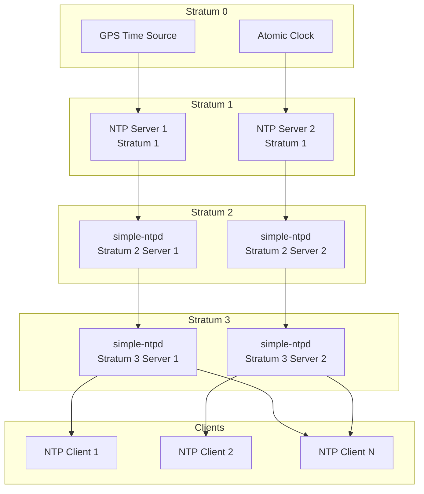
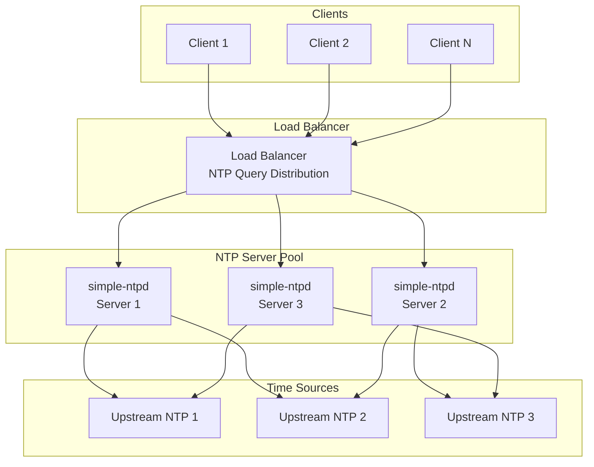

# Simple NTP Daemon - Deployment Diagrams

## Basic Deployment Architecture

```mermaid
graph TB
    subgraph "Client Network"
        Client1[NTP Client 1]
        Client2[NTP Client 2]
        ClientN[NTP Client N]
    end

    subgraph "NTP Server"
        Server[simple-ntpd<br/>Main Process]
        Config[/etc/simple-ntpd/<br/>Configuration]
        Logs[/var/log/simple-ntpd/<br/>Log Files]
    end

    subgraph "Time Sources"
        Upstream1[Upstream NTP Server 1<br/>pool.ntp.org]
        Upstream2[Upstream NTP Server 2<br/>time.google.com]
        SystemClock[System Clock<br/>OS Time]
    end

    subgraph "System Services"
        Systemd[systemd<br/>Service Manager]
    end

    Client1 --> Server
    Client2 --> Server
    ClientN --> Server

    Systemd --> Server
    Systemd --> Config

    Server --> Config
    Server --> Logs
    Server --> Upstream1
    Server --> Upstream2
    Server --> SystemClock
```

## Stratum Hierarchy Deployment



## High Availability NTP Deployment


