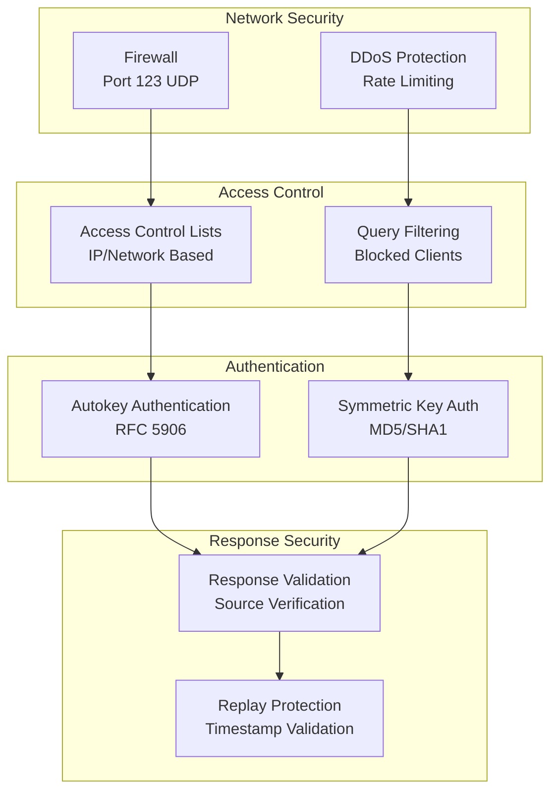
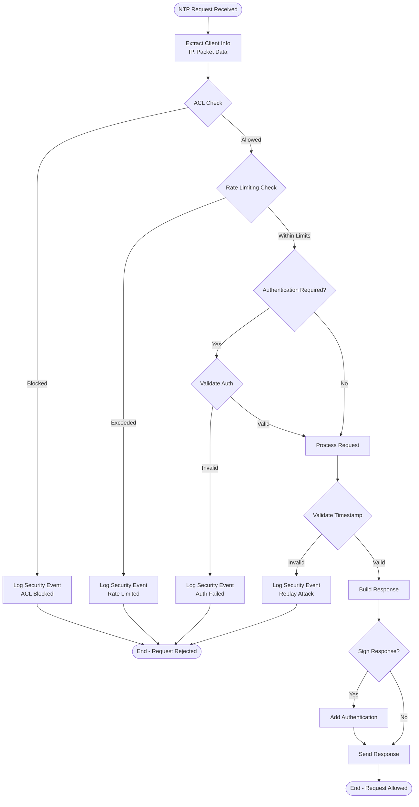

# Simple NTP Daemon - Security Diagrams

## Security Architecture

```mermaid
graph TB
    subgraph "Network Security"
        Firewall[Firewall<br/>Port 123 UDP]
        DDoSProtection[DDoS Protection<br/>Rate Limiting]
    end

    subgraph "Access Control"
        ACL[Access Control Lists<br/>IP/Network Based]
        QueryFilter[Query Filtering<br/>Blocked Clients]
    end

    subgraph "Authentication"
        Autokey[Autokey Authentication<br/>RFC 5906]
        SymmetricKey[Symmetric Key Auth<br/>MD5/SHA1]
    end

    subgraph "Response Security"
        ResponseValidation[Response Validation<br/>Source Verification]
        ReplayProtection[Replay Protection<br/>Timestamp Validation]
    end

    Firewall --> ACL
    DDoSProtection --> QueryFilter

    ACL --> Autokey
    QueryFilter --> SymmetricKey

    Autokey --> ResponseValidation
    SymmetricKey --> ResponseValidation

    ResponseValidation --> ReplayProtection
```

## Security Flow

```mermaid
flowchart TD
    Start([NTP Request Received]) --> ExtractInfo[Extract Client Info<br/>IP, Packet Data]

    ExtractInfo --> ACLCheck{ACL Check}
    ACLCheck -->|Blocked| LogBlock1[Log Security Event<br/>ACL Blocked]
    ACLCheck -->|Allowed| RateLimitCheck

    RateLimitCheck{Rate Limiting Check}
    RateLimitCheck -->|Exceeded| LogBlock2[Log Security Event<br/>Rate Limited]
    RateLimitCheck -->|Within Limits| AuthCheck

    AuthCheck{Authentication Required?}
    AuthCheck -->|Yes| ValidateAuth{Validate Auth}
    AuthCheck -->|No| ProcessRequest

    ValidateAuth -->|Invalid| LogBlock3[Log Security Event<br/>Auth Failed]
    ValidateAuth -->|Valid| ProcessRequest

    ProcessRequest[Process Request] --> ValidateTimestamp{Validate Timestamp}
    ValidateTimestamp -->|Invalid| LogBlock4[Log Security Event<br/>Replay Attack]
    ValidateTimestamp -->|Valid| BuildResponse

    BuildResponse[Build Response] --> SignResponse{Sign Response?}
    SignResponse -->|Yes| AddAuth[Add Authentication]
    SignResponse -->|No| SendResponse

    AddAuth --> SendResponse[Send Response]

    LogBlock1 --> End([End - Request Rejected])
    LogBlock2 --> End
    LogBlock3 --> End
    LogBlock4 --> End
    SendResponse --> End2([End - Request Allowed])
```
