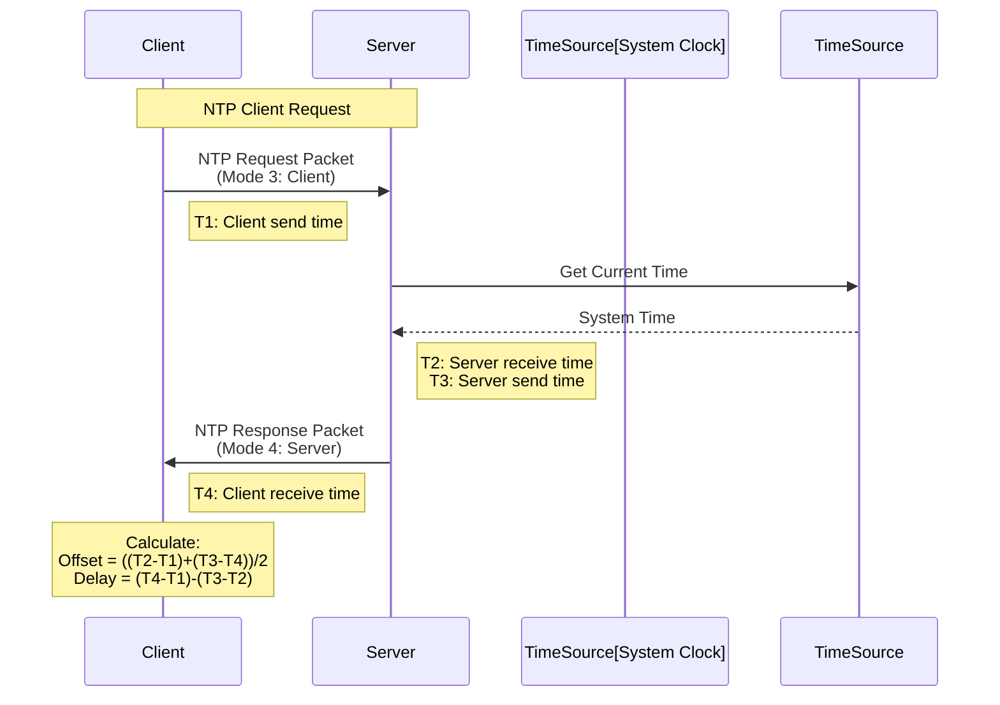
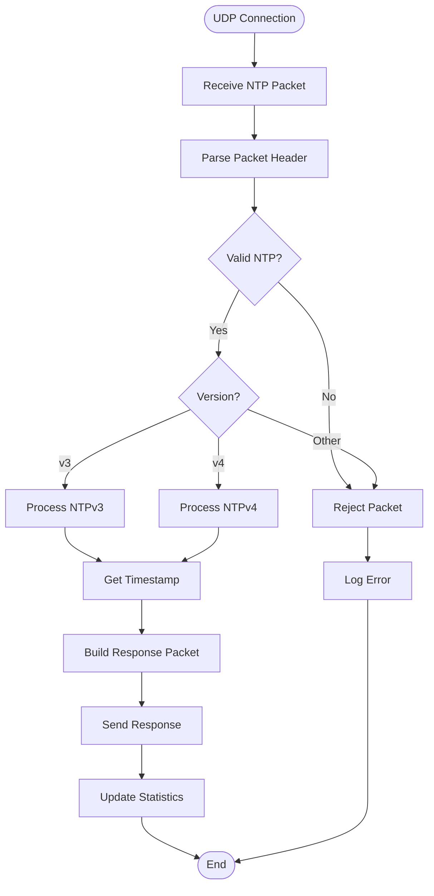

# Simple NTP Daemon - Flow Diagrams

## NTP Request/Response Flow

```mermaid
sequenceDiagram
    participant Client
    participant Server
    participant TimeSource[System Clock]
    
    Note over Client,Server: NTP Client Request
    Client->>Server: NTP Request Packet<br/>(Mode 3: Client)
    Note right of Client: T1: Client send time
    
    Server->>TimeSource: Get Current Time
    TimeSource-->>Server: System Time
    Note right of Server: T2: Server receive time<br/>T3: Server send time
    
    Server->>Client: NTP Response Packet<br/>(Mode 4: Server)
    Note right of Client: T4: Client receive time
    
    Note over Client: Calculate:<br/>Offset = ((T2-T1)+(T3-T4))/2<br/>Delay = (T4-T1)-(T3-T2)
```

## Connection Management Flow

```mermaid
flowchart TD
    Start([UDP Connection]) --> Receive[Receive NTP Packet]
    Receive --> Parse[Parse Packet Header]
    Parse --> Validate{Valid NTP?}
    Validate -->|No| Reject[Reject Packet]
    Validate -->|Yes| CheckVersion{Version?}
    
    CheckVersion -->|v3| ProcessV3[Process NTPv3]
    CheckVersion -->|v4| ProcessV4[Process NTPv4]
    CheckVersion -->|Other| Reject
    
    ProcessV3 --> GetTimestamp[Get Timestamp]
    ProcessV4 --> GetTimestamp
    GetTimestamp --> BuildPacket[Build Response Packet]
    BuildPacket --> Send[Send Response]
    Send --> UpdateStats[Update Statistics]
    
    Reject --> LogError[Log Error]
    UpdateStats --> End([End])
    LogError --> End
```

